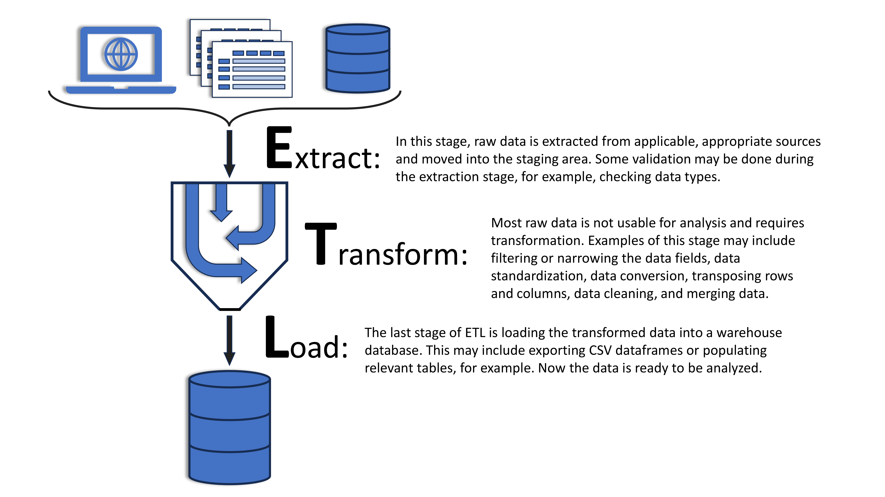
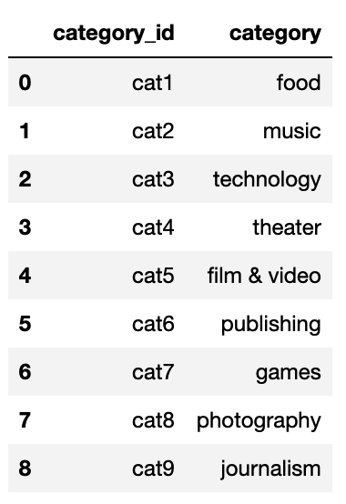
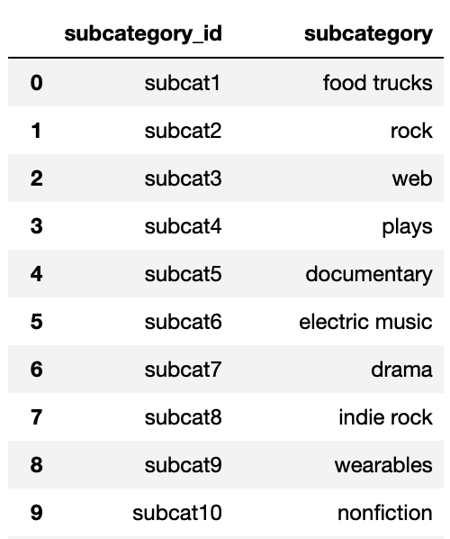
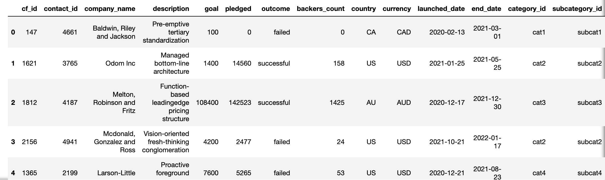
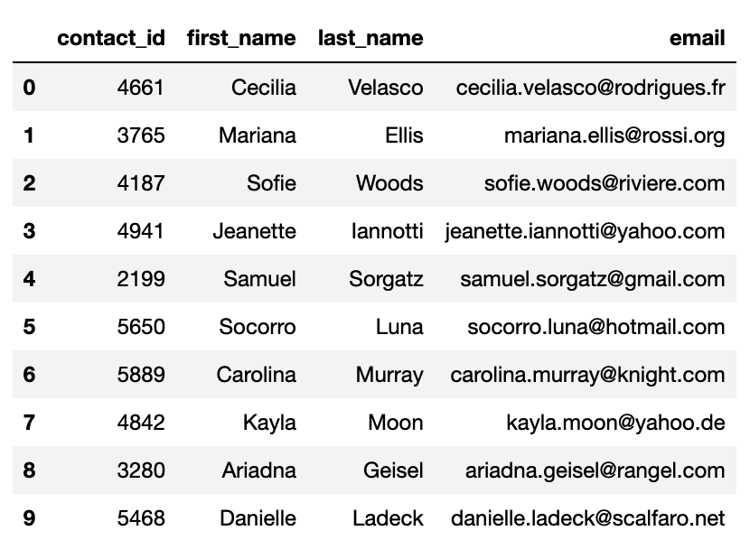

# Crowdfunding_ETL
#### Project 2 partners:
### - Lucinda Hodgson
### - Cindy Hansel

 

 For this project we each worked on the code and then came together to compare what we had done, and decide on the final product after reviewing the areas where our code differed. We both chose to complete option 2 as we believed it more directly related to the more recent class work and we wanted to use those skills. We also completed option 1 as practice but have commented out all of that code with ###. 
 
Data sources provided:

crowdfunding.xlsx

contacts.xlsx

For the ETL mini project, you will work with a partner to practice building an ETL pipeline using Python, Pandas, and either Python dictionary methods or regular expressions to extract and transform the data. After you transform the data, you'll create four CSV files and use the CSV file data to create an ERD and a table schema. Finally, you’ll upload the CSV file data into a Postgres database.

### Instructions
The instructions for this mini project are divided into the following subsections:

- Create the Category and Subcategory DataFrames
- Create the Campaign DataFrame
- Create the Contacts DataFrame
- Create the Crowdfunding Database

 Create the Category and Subcategory DataFrames
1. Extract and transform the crowdfunding.xlsx Excel data to create a category DataFrame that has the following columns:

- A "category_id" column that has entries going sequentially from "cat1" to "catn", where n is the number of unique categories

- A "category" column that contains only the category titles

The following image shows this category DataFrame:

2. Export the category DataFrame as category.csv and save it to your GitHub repository.

3. Extract and transform the crowdfunding.xlsx Excel data to create a subcategory DataFrame that has the following columns:

- A "subcategory_id" column that has entries going sequentially from "subcat1" to "subcatn", where n is the number of unique subcategories

- A "subcategory" column that contains only the subcategory titles

The following image shows this subcategory DataFrame:

4. Export the subcategory DataFrame as subcategory.csv and save it to your GitHub repository.

Create the Campaign DataFrame

1. Extract and transform the crowdfunding.xlsx Excel data to create a campaign DataFrame has the following columns:

- The "cf_id" column

- The "contact_id" column

- The "company_name" column

- The "blurb" column, renamed to "description"

- The "goal" column, converted to the float data type

- The "pledged" column, converted to the float data type

- The "outcome" column

- The "backers_count" column

- The "country" column

- The "currency" column

- The "launched_at" column, renamed to "launch_date" and with the UTC times converted to the datetime format

- The "deadline" column, renamed to "end_date" and with the UTC times converted to the datetime format

- The "category_id" column, with unique identification numbers matching those in the "category_id" column of the category DataFrame

- The "subcategory_id" column, with the unique identification numbers matching those in the "subcategory_id" column of the subcategory DataFrame

- The following image shows this campaign DataFrame:

2. Export the campaign DataFrame as campaign.csv and save it to your GitHub repository.

Create the Contacts DataFrame

Choose one of the following two options for extracting and transforming the data from the contacts.xlsx Excel data:

Option 1: Use Python dictionary methods.

Option 2: Use regular expressions.

If you chose Option 1, complete the following steps:

Import the contacts.xlsx file into a DataFrame.
Iterate through the DataFrame, converting each row to a dictionary.
Iterate through each dictionary, doing the following:
Extract the dictionary values from the keys by using a Python list comprehension.
Add the values for each row to a new list.
Create a new DataFrame that contains the extracted data.
Split each "name" column value into a first and last name, and place each in a new column.
Clean and export the DataFrame as contacts.csv and save it to your GitHub repository.

If you chose Option 2, complete the following steps:

Import the contacts.xlsx file into a DataFrame.
Extract the "contact_id", "name", and "email" columns by using regular expressions.
Create a new DataFrame with the extracted data.
Convert the "contact_id" column to the integer type.
Split each "name" column value into a first and a last name, and place each in a new column.
Clean and then export the DataFrame as contacts.csv and save it to your GitHub repository.

Check that your final DataFrame resembles the one in the following image:

Create the Crowdfunding Database

1. Inspect the four CSV files, and then sketch an ERD of the tables by using QuickDBDLinks to an external site..

2. Use the information from the ERD to create a table schema for each CSV file.

Note: Remember to specify the data types, primary keys, foreign keys, and other constraints.

3. Save the database schema as a Postgres file named crowdfunding_db_schema.sql, and save it to your GitHub repository.

4. Create a new Postgres database, named crowdfunding_db.

5. Using the database schema, create the tables in the correct order to handle the foreign keys.

6. Verify the table creation by running a SELECT statement for each table.

7. Import each CSV file into its corresponding SQL table.

8. Verify that each table has the correct data by running a SELECT statement for each.
